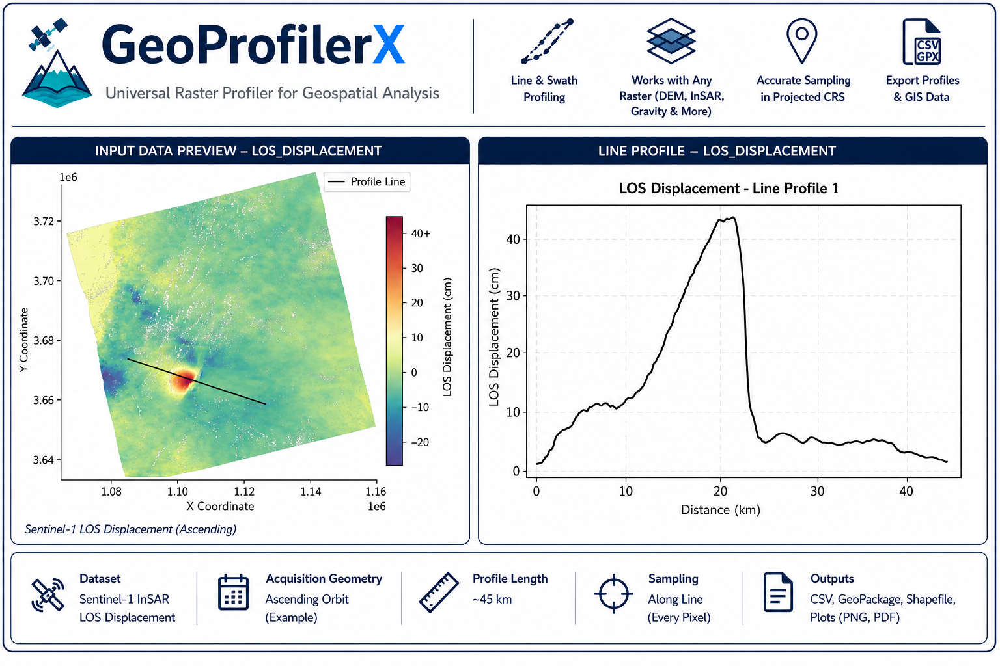

# GeoProfilerX


[](https://doi.org/10.5281/zenodo.22013091)

<p align="center">
  
</p>

GeoProfilerX is an open-source Python tool for extracting **line** and **swath profiles** from **projected single-band raster datasets** using **LineString** and **MultiLineString** vector geometries. It is designed for topographic, geophysical, remote sensing, environmental, and other geospatial applications, producing publication-quality profile visualizations and GIS-ready outputs for further analysis.

## Project Evolution

GeoProfilerX is the next-generation evolution of my earlier **GeoProfiler** project.

While GeoProfiler was developed specifically for extracting topographic profiles from Digital Elevation Models (DEMs), GeoProfilerX extends the concept into a general-purpose raster profiling tool capable of extracting both **line** and **swath profiles** from a broad range of **projected single-band raster datasets**, including DEMs, InSAR displacement products, gravity and magnetic anomalies, terrain derivatives, environmental rasters, vegetation indices, and other geospatial datasets.

Compared with the original GeoProfiler, GeoProfilerX introduces:

- Compatibility with a broad range of projected single-band raster datasets
- Improved input validation, CRS handling, and error checking
- Publication-quality line and swath profile plots (PNG & PDF)
- CSV export of sampled profile values with X/Y coordinates
- Export sampled profile points with profile attributes to ESRI Shapefile and GeoPackage formats
- Organized output directories
- Execution summaries and processing statistics

--- 

GeoProfilerX provides a simple workflow for extracting publication-ready profiles from projected raster datasets while automatically handling common geospatial preprocessing tasks.

## Features

- Extract **line profiles** from projected raster datasets
- Extract **swath profiles** with user-defined swath width
- Supports LineString and MultiLineString vector geometries
- Automatic CRS validation and vector reprojection
- Validates raster overlap before processing
- Handles NoData values and optional profile smoothing
- Publication-quality line and swath profile plots (PNG & PDF)
- CSV export of sampled profile values with X/Y coordinates
- Export sampled profile points to ESRI Shapefile and GeoPackage formats
- Input data preview with raster and profile overlay
- Organized output directories (CSV, GeoPackage, PDF, PNG, Shapefiles)
- Execution summary with processing statistics

---

## Supported Raster Types

GeoProfilerX works with a broad range of **projected single-band rasters**, including:

- Digital Elevation Models (DEM)
- Gravity anomaly datasets
- Magnetic anomaly datasets
- InSAR displacement products
- Terrain derivatives
- Geophysical rasters
- Environmental and climate rasters
- Vegetation indices (e.g., NDVI)
- Other projected single-band raster datasets

---

## Requirements

- Python 3.10+

### Python Packages

- numpy
- scipy
- pandas
- matplotlib
- rasterio
- geopandas
- shapely

Install dependencies using:

```bash
pip install -r requirements.txt
```

---

## Input Requirements

### Raster

- Single-band raster
- Projected Coordinate Reference System (CRS) (e.g., UTM or other projected CRS with metric units)
- Raster format readable by Rasterio/GDAL (e.g., `.tif`, `.img`)

> The raster must contain valid georeferencing and CRS information. NoData values should be properly defined in the raster metadata when applicable.

### Vector

- LineString or MultiLineString geometries; for MultiLineString geometries, the longest line component is used for profile extraction.
- Supported formats: ESRI Shapefile (`.shp`, `.shx`, `.prj`, `.dbf`), GeoJSON (`.geojson`, `.json`), and GeoPackage (`.gpkg`)
- Vector dataset must have a defined CRS; it is automatically reprojected to match the raster CRS if necessary

> For ESRI Shapefiles, all required components (`.shp`, `.shx`, `.prj`, `.dbf`) should be provided together. The `.prj` file is required for CRS detection.

---

## Outputs

For each extracted profile, GeoProfilerX generates:

- Input data preview (PNG & PDF)
- Publication-quality line and swath profile plots (PNG & PDF)
- CSV export of sampled profile values with X/Y coordinates
- Export sampled points with attributes to ESRI Shapefile and GeoPackage formats

An execution summary is also printed after processing.

---

## Output Directory Structure

Generated outputs are automatically organized into dedicated directories:

```text
outputs/
├── csv/
├── geopackage/
├── pdf/
├── png/
└── shapefiles/
```

---

## Example Workflow

GeoProfilerX can be used in two ways:

### 1. Jupyter Notebook — Recommended

Use `GeoProfilerX.ipynb` in **Google Colab, Jupyter Notebook/JupyterLab, or VS Code**.

1. Open the notebook.
2. Update the **User Settings** with your input data.
3. Run the cells.

### 2. Python Script

Use `GeoProfilerX.py` as a standalone Python script in **any Python environment**.

1. Open `GeoProfilerX.py`.
2. Update the **User Settings** with your input data.
3. Run the script.

Generated outputs are automatically organized into dedicated subdirectories within the `outputs/` folder.

---

## Repository Structure

```
GeoProfilerX/
├── GeoProfilerX.py
├── GeoProfilerX.ipynb
├── README.md
├── requirements.txt
├── CITATION.cff
├── LICENSE
└── images/
```

---

## Future Development

Planned enhancements include:

- Interactive profile drawing
- Batch processing of multiple profile files
- Multi-raster profile extraction

---

## License

This project is licensed under the MIT License.

---

## Author

**Chandni Verma**

LinkedIn: <https://www.linkedin.com/in/chandni-verma-geo>

GitHub: <https://github.com/chandnivermageo>

---

## Citation

If you use GeoProfilerX in your research, please cite this tool using the citation information provided below.

```

Verma, C. (2026). GeoProfilerX: A Python Tool for Extracting Line and Swath Profiles from Projected Raster Datasets (Version v1.0.0) [Computer software]. Zenodo. https://doi.org/10.5281/zenodo.22013091

```
